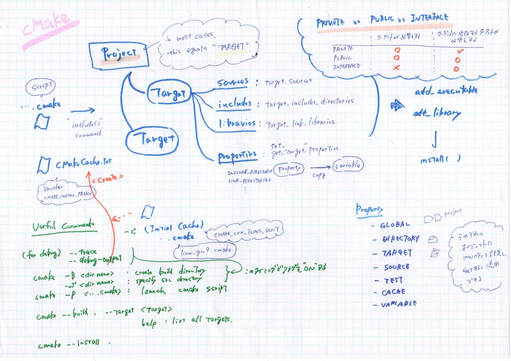
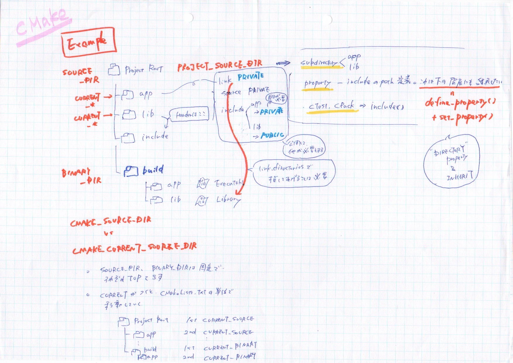
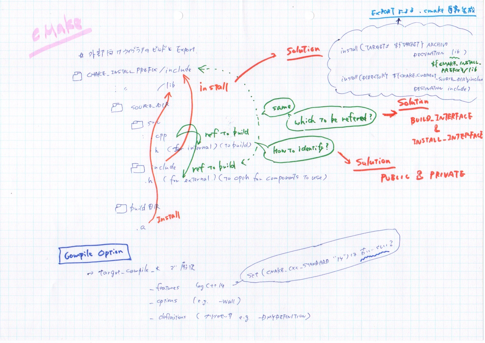
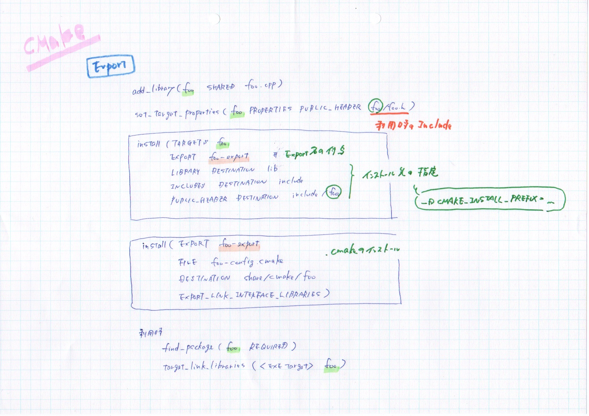
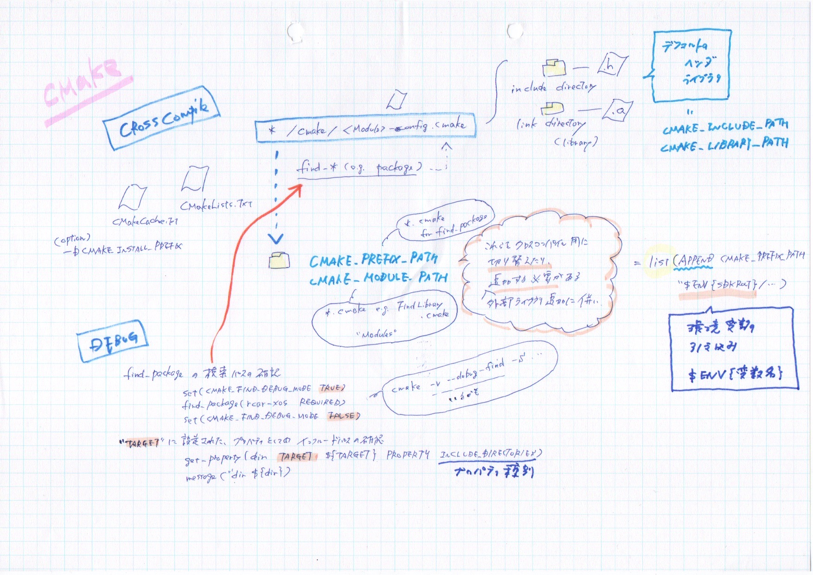

# cmake_sample





# to do
```
- CMAKE_FIND_ROOT_PATH
- BUILD_INTERFACE, INSTALL_INTERFACE
target_include_directories(${TARGET}
    PUBLIC  $<BUILD_INTERFACE: ${CMAKE_CURRENT_SOURCE_DIR}/include/my-lib>
            $<INSTALL_INTERFACE: include/my-lib> # = <install prefix>/include/my-lib
)
```


```
> cd lib
> cmake -S . -B build -DCMAKE_INSTALL_PREFIX=./build/install
> cmake --build build
> cmake --install build

> cd ../app
> cmake -S . -B build -DCMAKE_INSTALL_PREFIX=./build/install
> cmake --build build
> cmake --install build
```
