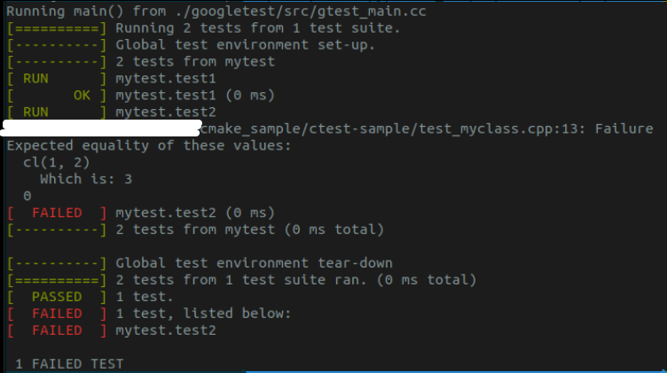

# Ctest
## Prerequisite
- sudo apt install googletest libgtest-dev

## Steps
1. cmake . -B build
1. cd build
1. cmake --build .
1. "ctest" or "my-ctest"

Result of "ctest"  

Result of "my-ctest"  

